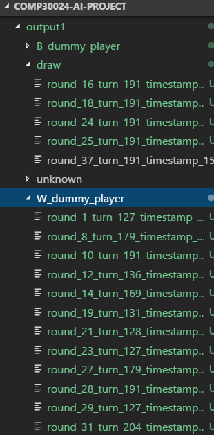

# comp30024-ai-project

> Part B Submission Branch

## Documentation

```
make html
```

## Unit tests
```
pytest
```

## Play against self
```
python ./referee.py player player
```

## Play against dummy player
```
python ./referee.py player dummpy_player
```

## "Bake-off" (playing different agents against each other)

For example:
```
python ./bakeoff.py test_output dummy_player minimax_player 50
```

Will play DummyPlayer against MiniMaxPlayer for 50 rounds, 
and store the output in `test_output/`.

`test_output/` will look like this:



Each folder corresponds one outcome (White wins/Black wins/Draw), and contains the output of the playout in which that player has won.

By counting the number of files in each folder, we can tell how well each player is against each other.

The file names also show how many turns it took for one player to kill the other.

## Notes about assessment criteria:
	Total: 22 marks
		- 4 marks
			- quality of code
			- OOP
			- readability
			- comments & docstrings
		- 4 marks
			- correctness of program
			- no runtime errors
			- no illegal moves
			- no violation of memory constraints (100MB entire game)
			- no violation of time constraints (60s entire game)
		- 7 marks
			- performance of our Player againts smart AI
		- 7 marks
			- pro-active points
			- techniques used not taught in lectures
